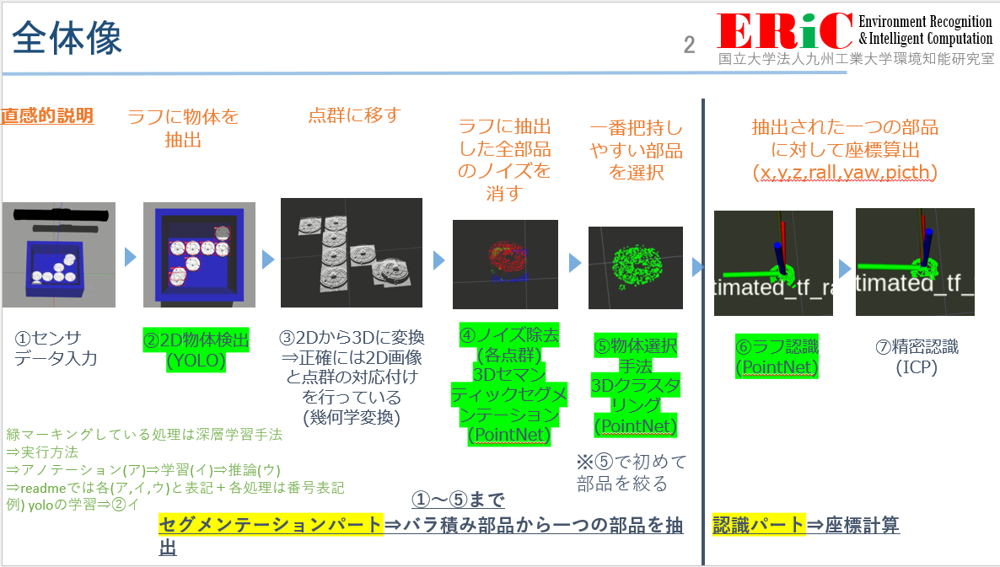

# 各処理の実行方法

全体像


### 環境構築で使えるリスト
```
sudo apt install ros-noetic-ros-numpy


sudo apt install pcl-tools


sudo apt install -y libpcl-dev


sudo apt install -y python3-pip

sudo apt install -y python3-pcl
sudo apt install -y python3-h5py
pip3 install open3d
sudo apt install python3-catkin-tools
sudo apt install python3-catkin-pkg
sudo apt install python3-osrf-pycommon
pip3 install torch==1.7.1+cpu torchvision==0.8.2+cpu torchaudio==0.7.2 -f https://download.pytorch.org/whl/torch_stable.html

sudo apt install -y ros-noetic-tf2-sensor-msgs
cd ~/ros_package/denso_ws 
rosdep update
rosdep install --from-paths src --ignore-src -r -y
```

### Estimation Test 
```
roslaunch tf_publish spawn_object.launch 

roslaunch tf_publish model_tf.launch

roslaunch cloud_practice planar_segmentation.launch

roslaunch estimator pose_estimator.launch

roslaunch tf_publish error_calculate.launch
```

### Getting dataset
```
roslaunch tf_publish spawn_object.launch 

roslaunch tf_publish model_tf.launch

roslaunch cloud_practice planar_segmentation.launch

roslaunch gen_dataset record_data.launch
```
### annotation pointnet
```
roslaunch tf_publish spawn_object.launch object_name:=HV8_barazumi

roslaunch tf_publish bara_model_tf.launch

roslaunch cloud_practice planar_segmentation.launch

roslaunch annotation_package mesh_cloud_bara_publish.launch

roslaunch annotation_package nearest_search_bara.launch

```

### segmentation dataset get
```
roslaunch tf_publish spawn_object.launch object_name:=sekai_small_box_and_50

roslaunch tf_publish bara_model_tf.launch 

roslaunch cloud_practice planar_segmentation.launch 

roslaunch annotation_package mesh_cloud_bara_publish.launch

roslaunch annotation_package nearest_search_bara_3.launch

```
##### semantic
```
roslaunch annotation_package dummy_cloud_pub_semaintic.launch

```
##### instance
```
roslaunch annotation_package dummy_cloud_pub_instance.launch
```
##### 実行
```
roslaunch annotation_package segmentation_dataset.launch 
```

### 推論
```
roslaunch tf_publish spawn_object.launch object_name:=sekai

roslaunch tf_publish bara_model_tf.launch 

roslaunch cloud_practice planar_segmentation.launch 

roslaunch estimator server.launch

roslaunch estimator client.launch

roslaunch estimator color_get.launch
```
##### semantic and instance switch_method
```
server.launch arch:=PointNet_Segmentation (semantic)
server.launch arch:=JSIS3D (instance)
```

### セグメンテーションの推論(精度算出フォーマット)
```
roslaunch tf_publish spawn_object.launch object_name:=1

roslaunch estimator color_get.launch
```
##### semantic and instance switch_launch_file
```
roslaunch estimator Acc_SemSeg.launch (semantic)
roslaunch estimator Acc_InsSeg.launch (instance)
```

### データセットの中身を見る
```
roslaunch annotation_package pcd_save_from_hdf5.launch path:=(hdf5ファイルのパス) index:=(データセットのインデックス)

roslaunch annotation_package cloud_save_2.launch

~/ros_package/denso_ws/src/denso_run/denso_2020/pc_segmentation/build/colored_cloud_view /home/ericlab/dummy_cloud/pcd_save.pcd
```

```
echo "export GAZEBO_MODEL_PATH=$GAZEBO_MODEL_PATH:${HOME}/ros_package/denso_ws/src/denso_run/rikuken_original/tf_publish/models" >> ~/.bashrc
```

### integration_run
```
roslaunch tf_publish spawn_object.launch object_name:=sekai_small_box_and_50
rosrun w2d_to_3d_ros move_saikyou_object.py 
rosrun estimator client_2D.py
rosrun estimator server_2D
roslaunch cloud_practice planar_segmentation.launch
roslaunch estimator integ_first.launch
roslaunch estimator integ_second.launch
roslaunch estimator color_get.launch
roslaunch estimator pcl_pub.launch 
```

### アノテーションの切り分け
```
roslaunch tf_publish semantic_annotation_world.launch object_name:=sekai_small_box_and_50(object_name wo korenisento error)
roslaunch annotation_package mesh_cloud_bara_publish.launch the_number_of_object:=31
rosrun w2d_to_3d_ros move_saikyou_object.py
roslaunch w2d_to_3d_ros ano_and_exec_3.launch
roslaunch annotation_package nearest_search_yolo_1.launch
roslaunch annotation_package dummy_2_semantic.launch
roslaunch annotation_package segmentation_kiriwake_dataset.launch num_dataset:=5000
```
### 左のパソコンのcatkin build
```
catkin build -DPYTHON_EXECUTABLE=/usr/bin/python3 -DPYTHON_INCLUDE_DIR=/usr/include/python3.7m
catkin config --cmake-args -DPYTHON_EXECUTABLE=/usr/bin/python3 -DPYTHON_INCLUDE_DIR=/usr/include/python3.7m

```
### ishiyama annotation
```
roslaunch tf_publish spawn_object.launch object_name:=sekai_small_box_and_50
roslaunch tf_publish bara_model_tf.launch object_count:=25
roslaunch cloud_practice ishiyama_PlaSeg.launch
roslaunch ishiyama_annotation mesh_cloud_bara_publish.launch
roslaunch ishiyama_annotation nearest_search_ishiyama.launch
roslaunch ishiyama_annotation dummy_cloud_pub_instance.launch
roslaunch ishiyama_annotation move_object.launch
roslaunch ishiyama_annotation record_hdf5.launch
roslaunch ishiyama_annotation Ano_main.launch
```
