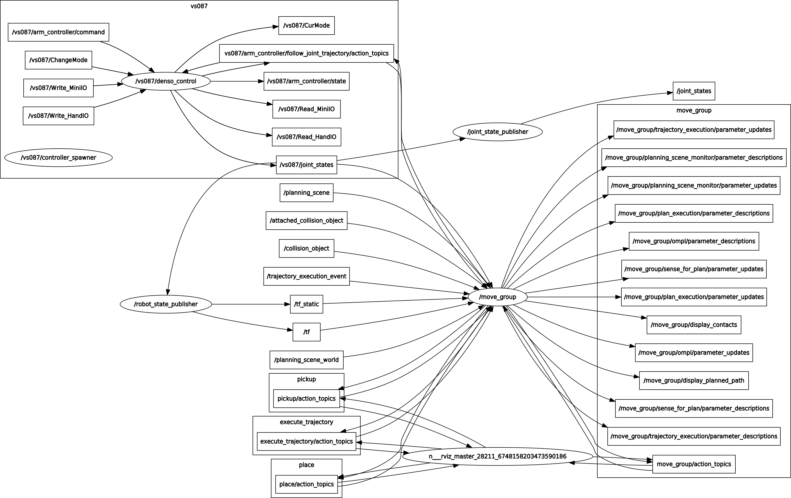

# denso_robot

## Overview
ROS real robot related packages for Denso robots

## Install
See [denso_apps](https://github.com/Nishida-Lab/denso_apps)

### rqt_graph
```bash
roslaunch denso_bringup vs087_bringup.launch sim:=false ip_address:=xxx.xxx.xxx.xxx
```


## CI
See [here](https://github.com/Nishida-Lab/denso_docs/tree/master/ci) for detail decumentation.

Replace the repository specific keywords in the above link as follows:
- `<your_repo>` -> `denso_robot`
- `<your_pkg>` -> `denso_control`, `bcap_core`, `bcap_service`, `bcap_service_test`, `denso_robot_core`, `denso_robot_core_test`
- `<your_rosinstall_dir>` -> `.`
