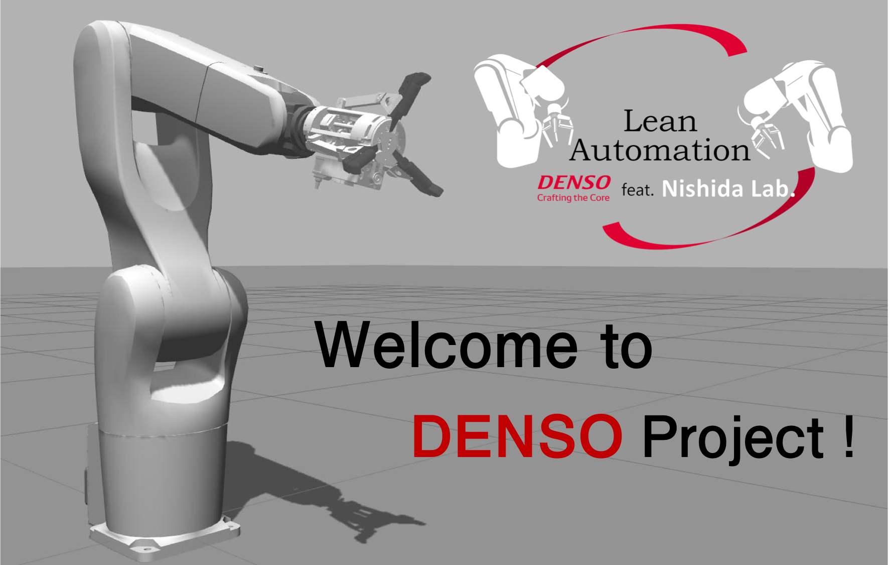
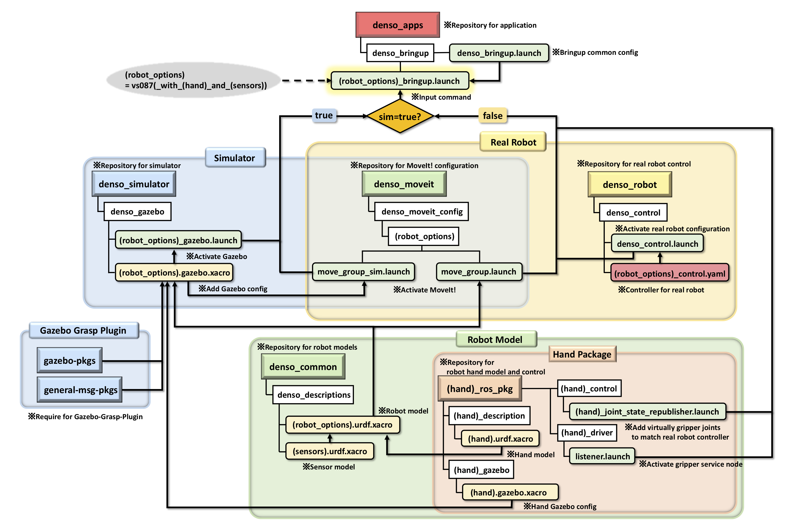

# denso_apps


## Overview
ROS application packages such as bringup or demos for Denso robots

## Requirements
- PhoXiControl
- Photoneo 3D Localization SDK

To install these, run below scripts.
```bash
cd scripts
sudo bash .preprocess
sudo reboot
```
Or get packages from [here](https://www.photoneo.com/3d-scanning-software/) or NAS and install it.

## Install
**NOTE:Make sure in advance that PhoXiControl and Photoneo 3D Localization SDK are correctly installed on your computer.**

```bash
cd your_ws/src
git clone https://github.com/Nishida-Lab/denso_apps.git
cd denso_apps/scripts

# Run only one of the scripts shown below
./install.sh # If you use https, run this script
./install_use_ssh.sh # If you use ssh, run this script
```

## Usage

### bringup
#### args
- sim
  - true : bringup on simulation (default)
  - false : bringup with real robot
- ip_address
  - specify robot's IP address (required only when sim:=true)
- planner
  - ompl : use OMPL as a robot motion planner (default)
  - stomp : use STOMP as a robot motion planner
  - chomp : use CHOMP as a robot motion planner

#### Real robot
```bash
roslaunch denso_bringup vs087_bringup.launch sim:=false ip_address:=xxx.xxx.xxx.xxx
```

#### Real robot with hand and sensor using STOMP planner
For example,
```bash
roslaunch denso_bringup vs087_with_mhand2_and_photoneo_bringup.launch sim:=false ip_address:=xxx.xxx.xxx.xxx planner:=stomp
```

#### Simulation
For example,
```bash
roslaunch denso_bringup vs087_with_robotiq_bringup.launch planner:=stomp
```



## CI
See [here](https://github.com/Nishida-Lab/denso_docs/tree/master/ci) for detail decumentation.

Replace the repository specific keywords in the above link as follows:

- `<your_repo>` -> `denso_apps`
- `<your_pkg>` -> `denso_bringup`, `denso_calib_gazebo`
- `<your_rosinstall_dir>` -> `.rosinstalls`

