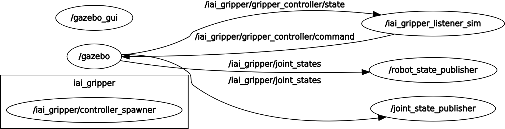

# iai_gripper_ros_pkg

## Description
ROS(kinetic) package for iai gripper(**designed for VS087**)

**NOTE: real robot required! NOT simulation robot.**

**This package assumes send format is 288(HandI/O and MiniI/O) and recv format 290(HandI/O and MiniI/O)**

IAI-GRIPPER control is provided as ROS service shown below.

---
#### Available ROS services
```
/iai_gripper/move_gripper
/iai_gripper/origin_return
/iai_gripper/pause
/iai_gripper/servo
/iai_gripper/get_position
/iai_gripper/reset
```

#### Available gripper position
- position=0: full close(origin)
- position=1: open from the inside of circular work and grasp it
- position=2: grasp the inside and the outside of the circular work between them
- position=3: grasp with circular surface of circular work in between
- position=4: full open

for example,
```
$ rosservice call /iai_gripper/move_gripper "position: 0" # full close
```

---

## Description for Simulator

**NOTE: simulation robot required! NOT real robot.**

IAI-GRIPPER-Sim control is provided as ROS service shown below.

---

#### /iai_gripper/get_hand_status (iai_gripper_gazebo_srvs/GetStatus)

Return the status of the IAI-GRIPPER as the following string

- "open"
- "close"
- "middle"

#### /iai_gripper/get_hand_position (iai_gripper_gazebo_srvs/GetJointsValue)

Return the current finger joints value[rad]

#### /iai_gripper/set_hand_position (iai_gripper_gazebo_srvs/SetJointsValue)

Set the specified finger joints value[rad]

Input one value (from -0.007 to 0.0) , set all finger values to the value

#### /iai_gripper/hand_open (iai_gripper_gazebo_srvs/Move)

Open hand full (Set all finger joints value to 0)

#### /iai_gripper/hand_close (iai_gripper_gazebo_srvs/Move)

Close hand full (Set all finger joints value to -0.007)

---

## Dependency
[Nishida-Lab/denso_robot_ros](https://github.com/Nishida-Lab/denso_robot_ros)

## Install
```
$ cd your_ws/src
$ git clone https://github.com/Nishida-Lab/denso_robot_ros.git
$ git clone https://github.com/Nishida-Lab/iai_gripper_ros_pkg.git
$ cd ..
$ rosdep install -iry --from-paths src
$ catkin build
```

## Usage
```
$ roslaunch denso_bringup vs087_bringup.launch sim:=false ip_address:=192.168.1.22
$ roslaunch iai_gripper_driver listener.launch
```
then, ROS services and gripper will be activated.

### Simulate gripper in Gazebo

```sh
$ roslaunch iai_gripper_gazebo spawn_iai_gripper.launch
```

then, ROS services will be activated.

#### Service Commands

- Get gripper status "open" , "close" or "middle"

```sh
$ rosservice call /iai_gripper/get_hand_status
```

return , for example

```sh
status: "open"
```

- Get positions of gripper finger joints

```sh
$ rosservice call /iai_gripper/get_hand_position
```

return , for example

```sh
type: "joint_position"
joint_names: [finger_A_joint, finger_B_joint]
values: [-0.005, -0.005,]
```

- Set position of gripper finger joint

```sh
$ rosservice call /iai_gripper/set_hand_position "value: (from -0.007 to 0.0)"
```

- Open gripper full

```sh
$ rosservice call /iai_gripper/hand_open
```

- Close gripper full

```sh
$ rosservice call /iai_gripper/hand_close
```




### Display gripper in rviz

```sh
$ roslaunch iai_gripper_description display_iai_gripper.launch
```

## CI
See [here](https://github.com/Nishida-Lab/denso_docs/tree/master/ci) for detail decumentation.

Replace the repository specific keywords in the above link as follows:
- `<your_repo>` -> `iai_gripper_ros_pkg`
- `<your_pkg>` -> `iai_gripper_description`, `iai_gripper_driver`, `iai_gripper_gazebo`, `iai_gripper_srvs`
- `<your_rosinstall_dir>` -> Nothing

