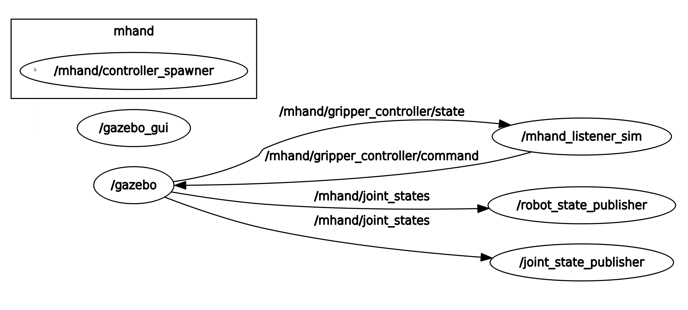

# mhand_ros_pkg

## Description

ROS(kinetic) package for M-HAND(**designed for VS087**, made by Maeda Kiko Co.,Ltd.)

**NOTE: real robot required! NOT simulation robot.**

**This package assumes send format is 288(HandI/O and MiniI/O) and recv format 290(HandI/O and MiniI/O)**

M-HAND control is provided as ROS service shown below.

---

#### /mhand/get_hand_status (mhand_srvs/GetStatus)

Return the status of the M-HAND as the following string

- "open"
- "close"
- "unknown"

#### /mhand/get_torque (mhand_srvs/GetTorque)

Return the torque setting value[%]

#### /mhand/set_torque (mhand_srvs/SetTorque)

Set the specified torque value[%]

Default torque value is 10%. **Up to 50% can be set for safety(limited by PLC)**

#### /mhand/hand_open (mhand_srvs/Move)

Open hand

#### /mhand/hand_close (mhand_srvs/Move)

Close hand

**NOTE: You can use their services when use mhand2**

---

## Description for Simulator

**NOTE: simulation robot required! NOT real robot.**

M-Hand-Sim control is provided as ROS service shown below.

---

#### /mhand/get_hand_status (mhand_gazebo_srvs/GetStatus)

Return the status of the M-Hand as the following string

- "open"
- "close"
- "middle"

#### /mhand/get_hand_position (mhand_gazebo_srvs/GetJointsValue)

Return the current finger joints value[rad]

#### /mhand/set_hand_position (mhand_gazebo_srvs/SetJointsValue)

Set the specified finger joints value[rad]

Input one value (from -1.22 to 0.0) , set all finger values to the value

#### /mhand/hand_open (mhand_gazebo_srvs/Move)

Open hand full (Set all finger joints value to -1.22)

#### /mhand/hand_close (mhand_gazebo_srvs/Move)

Close hand full (Set all finger joints value to 0)

**NOTE: When use mhand2 , name "mhand" becomes "mhand2"**

---

## Dependency

[Nishida-Lab/denso_robot_ros](https://github.com/Nishida-Lab/denso_robot_ros)

## Install

```sh
$ cd your_ws/src
$ git clone https://github.com/Nishida-Lab/denso_robot_ros.git
$ git clone https://github.com/Nishida-Lab/mhand_ros_pkg.git
$ cd ..
$ rosdep install -iry --from-paths src
$ catkin build
```

## Usage

### VS087

```sh
$ roslaunch denso_robot_bringup vs087_and_mhand_bringup.launch send_format:=288 recv_format:=290 sim:=false ip_address:=xxx.xxx.xxx.xxx
$ roslaunch mhand_driver listener.launch
```

then, ROS services will be activated.

### Simulate gripper in Gazebo

```sh
$ roslaunch mhand_gazebo spawn_mhand.launch robot_name:=$(mhand or mhand2)
```

then, ROS services will be activated.

#### Service Commands

- Get gripper status "open" , "close" or "middle"

```sh
$ rosservice call /mhand/get_hand_status
```

return , for example

```sh
status: "open"
```

- Get positions of gripper finger joints

```sh
$ rosservice call /mhand/get_hand_position
```

return , for example

```sh
type: "joint_position"
joint_names: [finger_A_joint, finger_B_joint, finger_C_joint]
values: [-0.5, -0.5, -0.5]
```

- Set position of gripper finger joint

```sh
$ rosservice call /mhand/set_hand_position "value: (from -1.22 to 0.0)"
```

- Open gripper full

```sh
$ rosservice call /mhand/hand_open
```

- Close gripper full

```sh
$ rosservice call /mhand/hand_close
```

**NOTE: When use mhand2 , name "mhand" becomes "mhand2"**



### Display gripper in rviz

```sh
$ roslaunch mhand_description display_mhand.launch robot_name:=$(mhand or mhand2)
```

## CI
See [here](https://github.com/Nishida-Lab/denso_docs/tree/master/ci) for detail decumentation.

Replace the repository specific keywords in the above link as follows:
- `<your_repo>` -> `mhand_ros_pkg`
- `<your_pkg>` -> `mhand_control`, `mhand_description`, `mhand_driver`, `mhand_gazebo`, `mhand_srvs`
- `<your_rosinstall_dir>` -> Nothing
