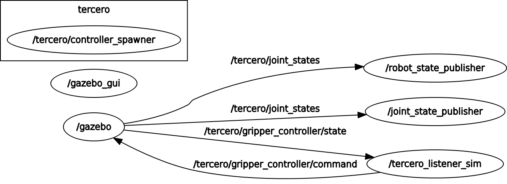

# tercero_ros_pkg

[](https://github.com/Nishida-Lab/tercero_ros_pkg/actions)

## Environment

- OS : Linux 16.04 x86_64
- Kernel : 4.15.0-60-generic
- INpack KernelModule version : 1.0.422.0

## install

- Document : [ixxat_INpact_Ethernet.pdf](https://github.com/Nishida-Lab/tercero_ros_pkg/blob/master/eip_pkg/docs/ixxat_INpact_Ethernet.pdf)

## Description

ROS(kinetic) package for Tercero-HAND(designed for VS087, made by Maeda Kiko Co.,Ltd.)

NOTE: real robot required! NOT simulation robot.

Tercero-HAND control is provided as ROS service shown below.

---

Tercero-HAND has chack and pusher fingers.

#### /tercero/chack_check

#### /tercero/pusher_check

Return state, each fingers is ready to move, as the following string.

- "Hand Chack(Pusher) is OK !!"

- "Hand Chack(Pusher) is Error !!"

#### /tercero/get_chack_state


#### /tercero/get_pusher_state

Return state, each finger is open , close... as following string,

- "open" ("up")

- "close" ("down")

- "Not Origin Position" *1

- "Invalid Number" *2

*1 **NOTE:** Fix hand position to Origin Position by using hand controller.

*2 **NOTE:** Something has error, Ethernet/IP or program config.

#### /tercero/get_chack_position

#### /tercero/get_pusher_position

Return the finger current joint position value [mm]

#### /tercero/get_chack_torque

#### /tercero/get_pusher_torque

Return the torque setting value [%]

#### /tercero/chack_open

#### /tercero/pusher_on

Set chack or pusher to state "open" ("up")

#### /tercero/chack_close

#### /tercero/pusher_off

Set chack or pusher to state "close" ("down")

#### /tercero/set_chack_torque

#### /tercero/set_pusher_torque

Set the specified torque value from 0 to 100 [%]

If not error, default torque value is 10%.

#### /tercero/grasp

First chack close, next pusher down.

#### /tercero/release

First pusher up, next chack open.

---

## Description for Simulator

**NOTE: simulation robot required! NOT real robot.**

Tercero-Sim control is provided as ROS service shown below.

---

#### /tercero/get_chack_state (tercero_gazebo_srvs/GetStatus)

#### /tercero/get_pusher_state (tercero_gazebo_srvs/GetStatus)

Return the state of the Tercero chack or pusher as the following string

- "open" ("on")
- "close" ("off")
- "middle"

#### /tercero/get_chack_position (tercero_gazebo_srvs/GetJointsValue)

#### /tercero/get_pusher_position (tercero_gazebo_srvs/GetJointsValue)

Return the current chack (pusher) finger joints value[m]

#### /tercero/set_chack_position (tercero_gazebo_srvs/SetJointsValue)

Set the specified "finger_R_joint" and "finger_L_joint" value[m]

Input one value (from 0.0 to 0.06(default)) , set both of the fingers value to the value

#### /tercero/set_pusher_position (tercero_gazebo_srvs/SetJointsValue)

Set the specified "finger_3rd_joints" value[m]

Input one value (from 0.0 to 0.035(default))

#### /tercero/chack_open (tercero_gazebo_srvs/Move)

Open chack full (Set "finger_L_joint" and "finger_R_joint" value to 0.0)

#### /tercero/chack_close (tercero_gazebo_srvs/Move)

Close chack full (Set all finger joints value to 0.06(default))

#### /tercero/pusher_on (tercero_gazebo_srvs/Move)

Down pusher full (Set "finger_3rd_joint" value to 0.035(default))

#### /tercero/pusher_off (tercero_gazebo_srvs/Move)

Up pusher full (Set "finger_3rd_joint" value to 0.0)

---

## Usage

### Simulate gripper in Gazebo

```sh
$ roslaunch tercero_gazebo spawn_tercero.launch
```

then, ROS services will be activated.

#### Service Commands

- Get gripper chack(pusher) status "open"("on") , "close"("off") or "middle"

```sh
$ rosservice call /tercero/get_chack_state
$ rosservice call /tercero/get_pusher_state
```

return , for example

```sh
status: "open"("on")
```

- Get positions of gripper chack(pusher) finger joints

```sh
$ rosservice call /tercero/get_chack_position
$ rosservice call /tercero/get_pusher_position
```

return , for example

```sh
type: "joint_position"
joint_names: [finger_L_joint, finger_R_joint]
values: [0.03, 0.03]
```

or

```sh
type: "joint_position"
joint_names: [finger_3rd_joint]
values: [0.01]
```

- Set position of chack finger joint , "finger_R_joint" and "finger_L_joint"

```sh
$ rosservice call /tercero/set_chack_position "value: (from 0.0 to 0.06(default))"
```

- Set position of pusher finger joint , "finger_3rd_joint"

```sh
$ rosservice call /tercero/set_pusher_position "value: (from 0.0 to 0.035(default))"
```

- Open chack full

```sh
$ rosservice call /tercero/chack_open
```

- Close chack full

```sh
$ rosservice call /tercero/chack_close
```

- Down pusher full

```sh
$ rosservice call /tercero/pusher_on
```

- Up pusher full

```sh
$ rosservice call /tercero/pusher_off
```



### Display gripper in rviz

```sh
$ roslaunch tercero_description display_tercero.launch
```

---

## CI
See [here](https://github.com/Nishida-Lab/denso_docs/tree/master/ci) for detail decumentation.

Replace the repository specific keywords in the above link as follows:

- `<your_repo>` -> `tercero_ros_pkg`
- `<your_pkg>` -> `tercero_description`, `tercero_gazebo`
- `<your_rosinstall_dir>` -> Nothing
