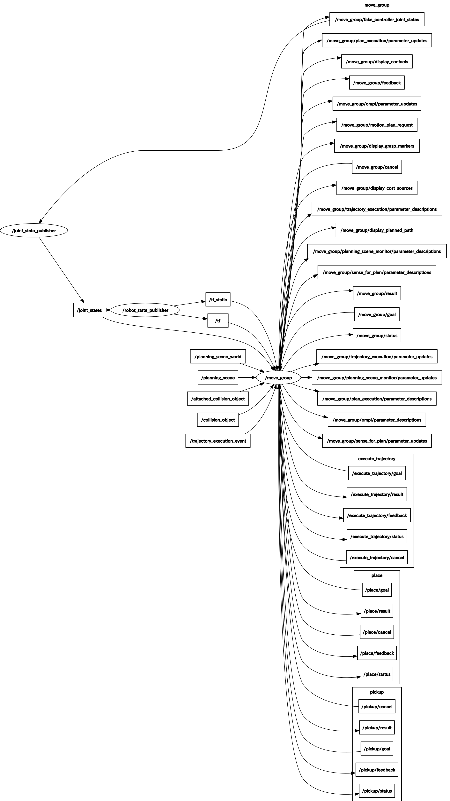

# denso_moveit

## Overview
ROS Moveit! related packages for Denso robots

## Install
See [denso_apps](https://github.com/Nishida-Lab/denso_apps)

## Usage

### MoveIt! with VS087 demo

#### args
- planner
  - ompl : use OMPL as a robot motion planner (default)
  - stomp : use STOMP as a robot motion planner
  - chomp : use CHOMP as a robot motion planner
  - multi : use OMPL, STOMP and CHOMP for robot motion plan

For example,

```bash
roslaunch vs087_moveit_config demo.launch planner:=stomp
```

#### rqt_graph



For more info, see [MoveIt! tutorials](https://ros-planning.github.io/moveit_tutorials/)

## CI
See [here](https://github.com/Nishida-Lab/denso_docs/tree/master/ci) for detail decumentation.

Replace the repository specific keywords in the above link as follows:
- `<your_repo>` -> `denso_moveit`
- `<your_pkg>` -> `vs087_moveit_config`
- `<your_rosinstall_dir>` -> `.`
