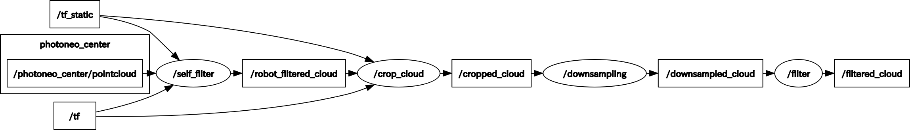

# denso_recognition

## Overview
ROS recognition packages for Denso robots

### Pointcloud preprocessing for generate octomap
- To robot self filter, crop, downsample and outliers filter souce pointclouds in order.

## Install

See [denso_apps](https://github.com/Nishida-Lab/denso_apps)

## Usage

### Pointcloud preprocessing for generate octomap
#### Command

For example,
```bash
roslaunch denso_recognition pc_preproc_for_octomap.launch
```

#### rqt_graph


#### args
##### For `robot_self_filter`
- robot_filter_pc_src (default: /photoneo_center/pointcloud)
  - source topic of pointcloud to be robot self filtered
- robot_filter_pc_dst (default: /robot_filtered_cloud)
  - destination topic of pointcloud that was robot self filtered

##### For `crop_cloud`
- loop_rate (default: 60)
  - pointcloud crop rate
- crop_x_min (default: 0.15)
  - x-axis minimum value of crop regeon [m]
- crop_x_max (default: 1.0)
  - x-axis maximum value of crop regeon [m]
- crop_y_min (default: -1.0)
  - y-axis minimum value of crop regeon [m]
- crop_y_max (default: 1.0)
  - y-axis maximum value of crop regeon [m]
- crop_z_min (default: 0.07)
  - z-axis minimum value of crop regeon [m]
- crop_z_max (default: 1)
  - z-axis maximum value of crop regeon [m]
- crop_pc_src (default: /robot_filtered_cloud)
  - source topic of pointcloud to be cropped
- crop_pc_dst (default: /cropped_cloud)
  - destination topic of pointcloud that was cropped
- use_rgb (default: false)
  - set to true if the pointcloud has RGB information
- crop_frame_id (default: world)
  - frame of cropped pointcloud

##### For `downsampling`
- downsample_pc_src (default: /cropped_cloud)
  - source topic of pointcloud to be downsampled
- downsample_pc_dst (default: /downsampled_cloud)
  - destination topic of pointcloud that was downsampled
- downsample_frame_id (default: world)
  - frame of downsampled pointcloud
- downsample_leafsize_x (default: 0.02)
  - x-axis leaf size of VoxelGrid [m]
- downsample_leafsize_y (default: 0.02)
  - y-axis leaf size of VoxelGrid [m]
- downsample_leafsize_z (default: 0.02)
  - z-axis leaf size of VoxelGrid [m]

##### For `filter`
- filter_pc_src (default: /downsampled_cloud)
  - source topic of pointcloud to be filtered
- filter_pc_dst (default: /filtered_cloud)
  - destination topic of pointcloud that was filtered
- filter_frame_id (default: world)
  - frame of filtered pointcloud
- filter_mean_k (default: 10)
  - the number of neighbors to analyze for each point is set for StatisticalOutlierRemoval filter
- filter_stddev_mul_thresh (default: 0.2)
  - standard deviation multiplier, means outliers are removed if the distance between points exceeds this value

### Mesh Cloud Publisher
#### References
##### Source Code
- PointCloudLibrary - mesh_sampling
   - https://github.com/PointCloudLibrary/pcl/blob/master/tools/mesh_sampling.cpp

##### Paper
-  R. Osada, T. Funkhouser, B. Chazelle, D. Dobkin, Shape distributions, *ACM Transactions on Graphics (TOG)*, 21(4), 807-832, 2002.
   - http://www.cs.princeton.edu/~funk/tog02.pdf

#### Commands

##### Terminal 1
```
$ PhoXiControl
```
##### Terminal 2
```
$ roslaunch denso_calib oneshot_calib_world_bringup_for_3dmarker.launch
```
##### Terminal 3
```
$ roslaunch meshcloud_publisher meshcloud_publisher.launch
```

### Pointcloud registrator for ICP

#### Commands

##### Terminal 1
```
$ PhoXiControl
```
##### Terminal 2
```
$ roslaunch denso_calib oneshot_calib_world_bringup_for_3dmarker.launch
```
##### Terminal 3
```
$ roslaunch phoxi_camera pxi_camera_center_sim.launch
```
##### Terminal 4
```
$ roslaunch oneshot_calibration_system pointcloud_extractor_test.launch
```
##### Terminal 5
```
$ roslaunch meshcloud_publisher meshcloud_publisher.launch
```
##### Terminal 6
```
$ roslaunch rosrun pointcloud_registrator pointcloud_registrator
```
After these command, the calculation result is showed in the terminal of ```roslaunch rosrun pointcloud_registrator pointcloud_registrator``` like this.
```
[ INFO] [1567484899.086419277, 111.406000000]: score : 0.000841877
----ICP's matrix------------------------
   0.999944   0.0107337 -0.00170989  0.00315036
 -0.0107387    0.999944  -0.0019151 -0.00419863
 0.00168923  0.00193348    0.999998   0.0476032
          0           0           0           1
----------------------------------------
```

## CI
See [here](https://github.com/Nishida-Lab/denso_docs/tree/master/ci) for detail decumentation.

Replace the repository specific keywords in the above link as follows:
- `<your_repo>` -> `denso_recognition`
- `<your_pkg>` -> `pointcloud_processing`, `ar_marker_urdf`
- `<your_rosinstall_dir>` -> `.`


## Reference
- STL to mesh cloud
  - https://github.com/GT-RAIL/rail_mesh_icp
