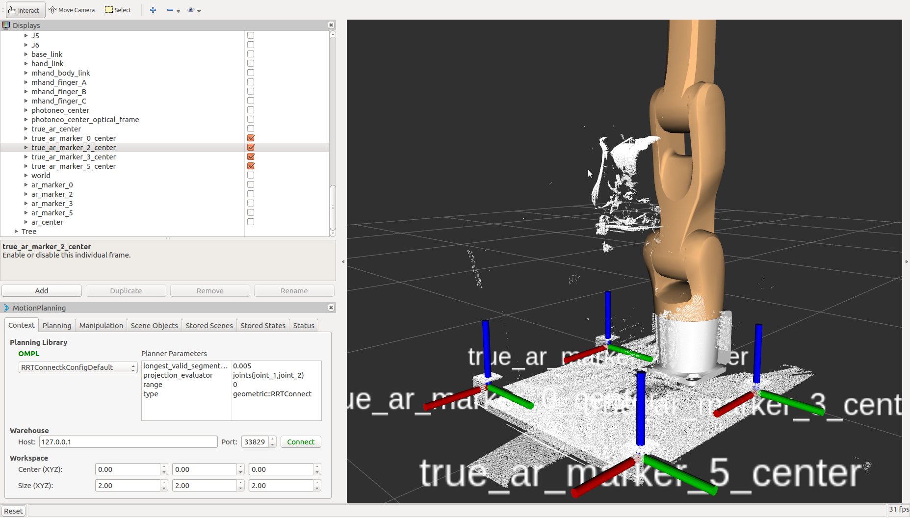
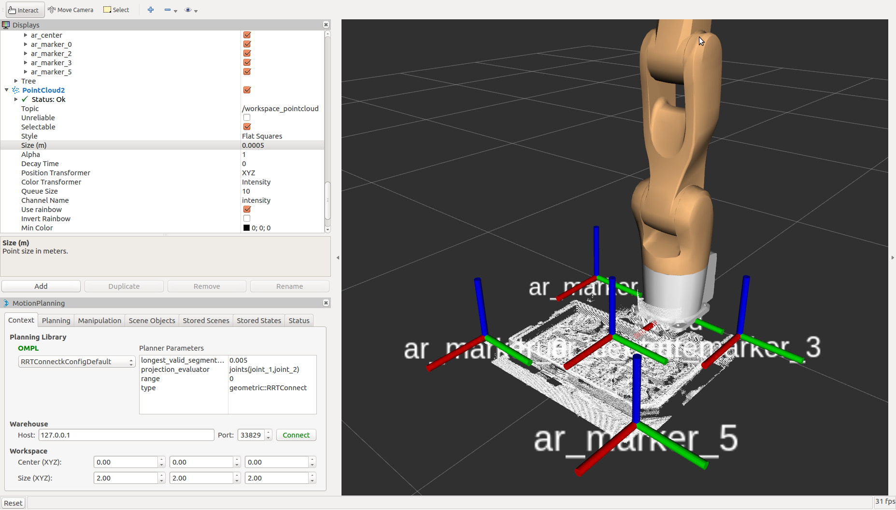

# oneshot_calibration_system [](https://travis-ci.com/Nishida-Lab/oneshot_calibration_system)

## Overview
This package calibrates objects' transform.

## Usage

### workspace calibration
1. ```PhoXiControl```
2. ```roslaunch denso_calib oneshot_calib_world_bringup_for_3dmarker.launch```
3. ```roslaunch phoxi_camera phoxi_camera_center.launch```
4. ```roslaunch denso_calib icp_calib_world_bringup_for_3dmarker.launch```



**Notice** : Change 3rd command to a command following below when you test or use this package on your local PC.

- ```roslaunch phoxi_camera phoxi_camera_center_sim.launch```

### defining workspace and extracting workspace_pointcloud

```roslaunch oneshot_calibration_system workspace_extraction.launch```



## related repositories(you need these for calibration)
- denso_recognition(https://github.com/Nishida-Lab/denso_recognition)
- denco_apps(https://github.com/Nishida-Lab/denso_apps)

## reference
- [Averaging Quaternions(paper)](http://www.acsu.buffalo.edu/~johnc/ave_quat07.pdf)
- [Averaging Quaternions(Qiita)](https://qiita.com/calm0815/items/d05e49dd4ce7c1f0c524)
